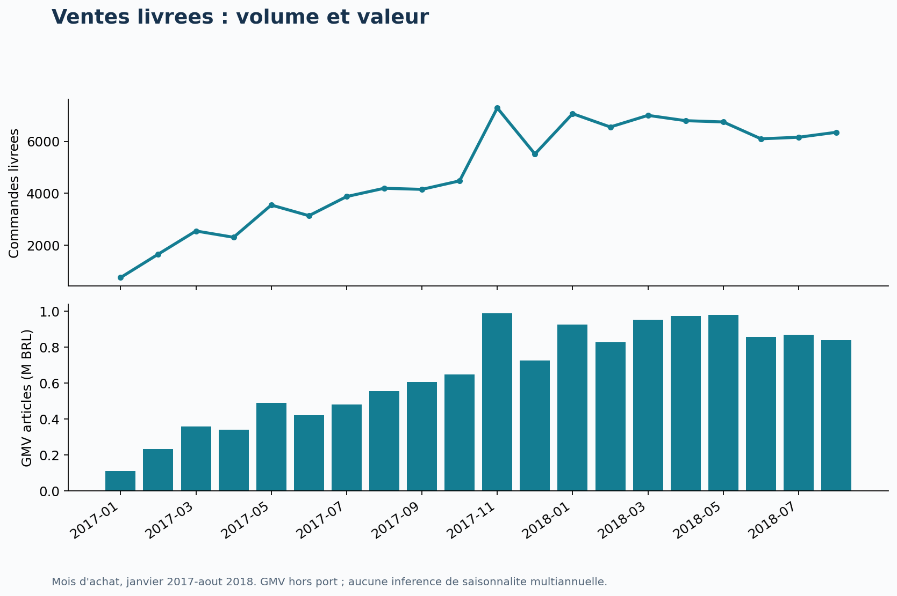
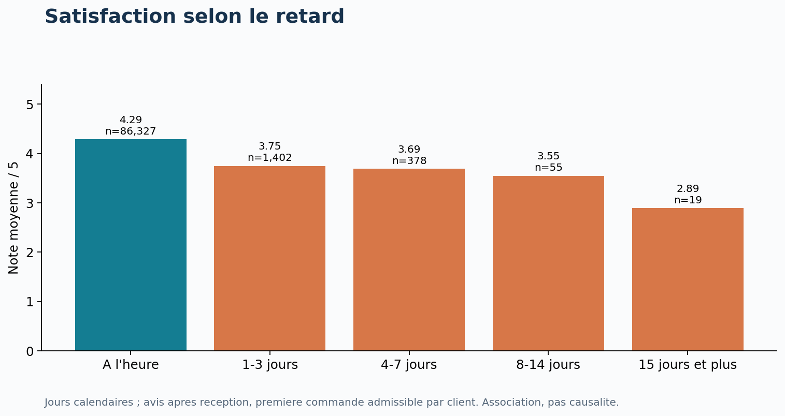
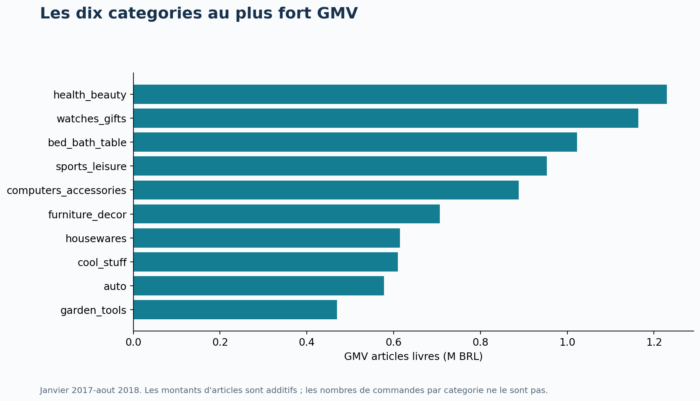
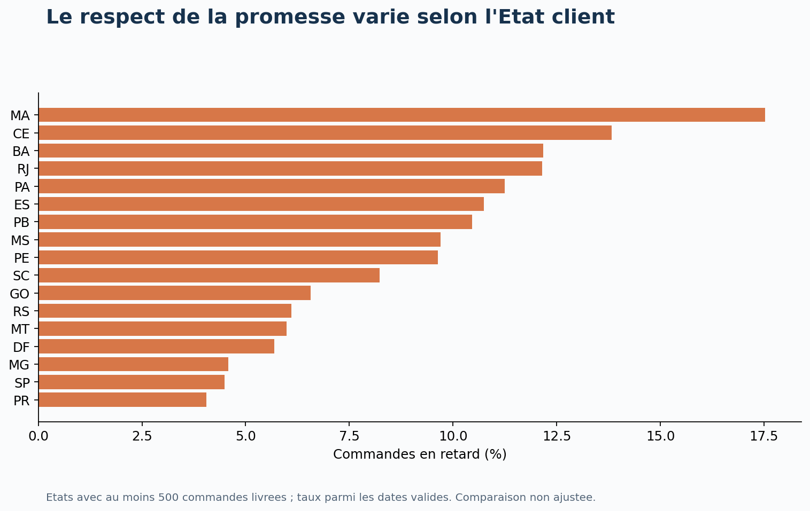
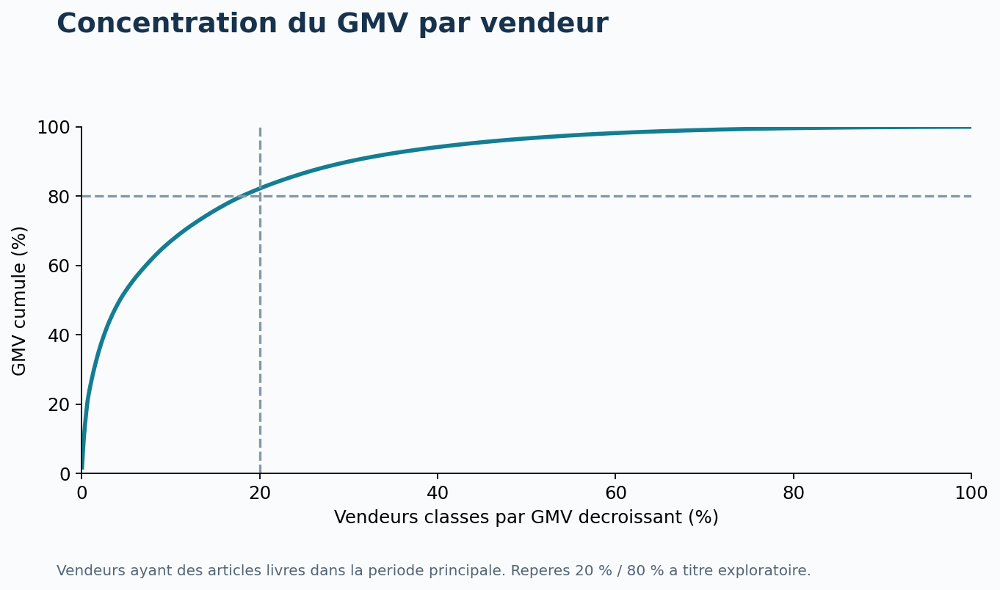
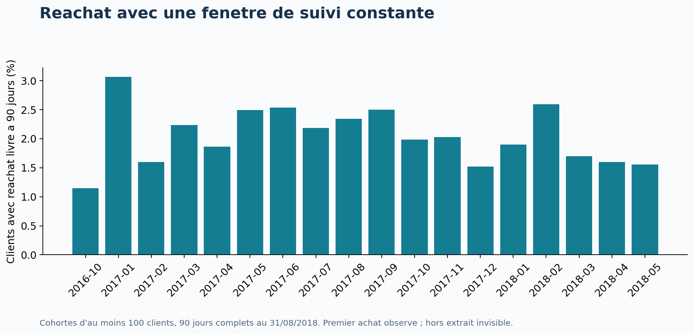

# Olist — Croissance, livraison et satisfaction client

Étude de cas Data Analyst · Python, SQL et préparation Power BI

**Commandes livrées : 96 211** | **GMV articles : 13,18 M BRL** | **Retard calendaire : 6,8 %** | **Réachat à 90 jours : 2,0 %**

Période principale : achats de janvier 2017 à août 2018. Cohortes de réachat : historique avec suivi complet.

## 1. La question métier

Comment accompagner la croissance des ventes tout en améliorant la fiabilité des livraisons et l'expérience client ? Cette étude simule une mission de Data Analyst auprès d'une marketplace. Elle vise à identifier des priorités d'investigation, puis à proposer des actions mesurables.

Le travail couvre 26 hypothèses sur les ventes, les produits, les vendeurs, les paiements, la géographie, la satisfaction et le réachat. Ce n'est pas une mission réellement commanditée par Olist : les décisions et expérimentations proposées sont celles d'un cas portfolio.

## 2. Résumé des résultats

Sur janvier–août, les commandes finalement livrées passent de 21 998 en 2017 à 52 783 en 2018 (+139,9 %). Le panier articles moyen passe de 136,1 à 136,8 BRL (+0,5 %). La croissance observée vient donc principalement du volume, et non d'une forte hausse du panier.

Les dix premières catégories concentrent 62,5 % du GMV. Les 20 % de vendeurs les plus importants en réalisent 82,2 %. Cette concentration justifie un suivi opérationnel prioritaire des vendeurs clés, sans présumer de leur marge ni de leur risque de départ.

Dans la population d'avis postérieurs à la réception, les retards sont associés à une note inférieure de 0,57 point (IC 95 % de l'écart retard moins ponctuel : [-0,63 ; -0,51]). Les commandes multi-vendeurs présentent un écart de -1,46 point par rapport aux mono-vendeur. Les groupes diffèrent aussi par d'autres caractéristiques : ces écarts ne sont pas des effets causaux.

Le réachat livré à 90 jours est de 2,0 %, soit 1 514 clients sur 75 387 éligibles. Il s'agit d'un comportement observé dans cet extrait et non du taux de fidélité global d'Olist.

Toutes les intuitions ne sont pas confirmées : São Paulo représente 38,4 % du GMV, sous le seuil exploratoire de 40 %. Le nombre de photos n'a pas d'association nette avec la note. La durée supplémentaire de retard parmi les seuls avis post-réception en retard n'est pas concluante après correction des tests.

## 3. Sources, périmètre et définitions

Neuf CSV fournis localement. Dates d'achat de l'extrait : 2016-09-04 21:15:19 à 2018-10-17 17:30:18. La période principale retient janvier 2017 à août 2018 : 2016 est fragmentaire et les derniers mois de 2018 présentent très peu de commandes. Cela ne prouve pas que les mois retenus couvrent toute l'activité d'Olist.

L'analyse est rétrospective, par date d'achat, avec le statut final et les événements disponibles dans les fichiers. Ce n'est pas une photographie de ce qui était connu au 31 août 2018. Les commandes des cohortes de réachat sont datées par leur achat et doivent être finalement livrées dans l'extrait.

GMV articles = somme de price pour les commandes livrées. Panier articles = GMV / nombre de commandes livrées. Les montants sont en BRL, sans correction d'inflation. Le port est traité séparément ; gross_value désigne articles + port. Les paiements ne sont pas additionnés au GMV.

Retard = jour de réception strictement postérieur au jour promis. Les dates manquantes ne sont pas assimilées à des livraisons ponctuelles. La note est celle du dernier avis de commande, de 1 à 5. Un avis négatif correspond à 1 ou 2. Une note de commande n'est pas une note propre à chacun de ses produits ou vendeurs.

Une commande peut contenir plusieurs lignes d'articles, paiements et avis. Le modèle agrège chaque table enfant avant les jointures avec les commandes. Il utilise customer_unique_id pour identifier un client entre achats. Les préfixes postaux restent du texte.

| Fichier | Lignes | Colonnes |
| --- | --- | --- |
| olist_customers_dataset.csv | 99441 | 5 |
| olist_geolocation_dataset.csv | 1000163 | 5 |
| olist_order_items_dataset.csv | 112650 | 7 |
| olist_order_payments_dataset.csv | 103886 | 5 |
| olist_order_reviews_dataset.csv | 99224 | 7 |
| olist_orders_dataset.csv | 99441 | 8 |
| olist_products_dataset.csv | 32951 | 9 |
| olist_sellers_dataset.csv | 3095 | 4 |
| product_category_name_translation.csv | 71 | 2 |

## 4. Qualité des données et décisions

Les identifiants de commandes, clients, produits, vendeurs et les clés composées testées sont uniques. Toutes les références étrangères vérifiées existent. Les totaux articles, port et paiements avant et après agrégation concordent.

Les 547 commandes avec plusieurs avis sont ramenées à un avis selon une règle déterministe : dernière réponse, puis création, review_id et position source. Les textes d'avis ne sont pas copiés dans le rapport. Les valeurs absentes restent manquantes.

Les chronologies incohérentes sont signalées. Une durée négative de préparation ou de transit est exclue de l'indicateur correspondant sans supprimer arbitrairement toute la commande. Les avis avant réception sont conservés dans les descriptifs, puis exclus du test principal de satisfaction post-réception.

Les coordonnées sont filtrées sur un rectangle large du Brésil puis agrégées par médiane du préfixe postal. Ce filtre simple n'est pas une validation par frontière nationale. La distance obtenue est une approximation à vol d'oiseau.

Les rapprochements paiements / articles + port gardent une tolérance de 0,01 BRL. Les anomalies restent visibles et ne sont pas forcées à zéro.

| Contrôle | Nombre | Traitement |
| --- | --- | --- |
| Commandes avec plusieurs avis | 547 | Dernier avis par date de reponse, puis creation, puis review_id, puis ordre source |
| Doublons review_id | 814 | review_id non utilise seul comme cle |
| Commandes sans articles | 775 | Montants laisses manquants |
| Commandes sans paiement | 1 | Montants laisses manquants |
| Commandes sans avis | 768 | Exclues des moyennes de notes |
| Livrees sans date de reception | 8 | Exclues des delais |
| Remise transporteur avant approbation | 1359 | Duree de preparation exclue |
| Reception avant remise transporteur | 23 | Duree de transit exclue |
| Avis repondu avant reception | 4654 | Conserves pour descriptif, exclus du test principal retard-note |
| Ecart paiement vs articles+port > 0,01 BRL | 303 | Signale, aucune correction arbitraire |
| Coordonnees hors rectangle large du Bresil | 42 | Exclues avant mediane par prefixe |

## 5. Ventes : séparer croissance, panier et calendrier

La comparaison annuelle porte sur les huit mêmes mois. Novembre est le mois le plus actif de 2017 avec 7 289 commandes livrées. Le dataset seul ne permet pas d'attribuer le pic à une promotion ou à Black Friday.

Le week-end compte en moyenne 127,9 commandes livrées achetées par jour, contre 170,3 en semaine. Le calcul tient compte du nombre de jours et inclut les jours sans vente. Une analyse ajustée du calendrier resterait nécessaire avant de modifier les effectifs ou les budgets.

Recommandation : suivre séparément volume, panier moyen et GMV, puis dimensionner la capacité logistique lors des pics. Vérifier ces schémas sur une période plus longue avant de les considérer comme une saisonnalité stable.

## 6. Livraison et satisfaction : un résultat sensible au choix des avis

Le taux de retard principal est de 6,8 %. Comparer les timestamps bruts donnerait 8,1 % : les promesses datées à minuit peuvent classer en retard une réception le même jour. La convention calendaire retenue doit accompagner le KPI.

Le délai médian observé est de 10,2 jours. Le mois d'achat au taux de retard le plus élevé est 2018-03, à 19,0 %. Il mérite un audit des transporteurs, vendeurs et territoires ; le dataset n'identifie pas la cause.

Seuls 29,9 % des avis de commandes en retard sont postérieurs à la réception (1 907 sur 6 378). Exclure les avis antérieurs retire donc une grande part de l'insatisfaction exprimée pendant l'attente. Le test H10 répond à la question de la satisfaction après réception, tandis que la première ligne de population décrit l'ensemble des avis disponibles.

La direction de l'association doit être lue avec son ampleur et cette sélection. La régression, les contrôles par vendeur/catégorie/mois et des données de transport seraient des approfondissements utiles ; ils ne sont pas prétendus réalisés ici.

| Population | Retard (1=oui) | Commandes notées | Note moyenne | Part notes 1–2 |
| --- | --- | --- | --- | --- |
| Tous avis disponibles | 0,000 | 89182 | 4,291 | 0,092 |
| Tous avis disponibles | 1,000 | 6378 | 2,271 | 0,624 |
| Avis apres reception, tous clients | 0,000 | 89005 | 4,292 | 0,092 |
| Avis apres reception, tous clients | 1,000 | 1907 | 3,719 | 0,195 |
| Avis apres reception, un par client (H10) | 0,000 | 86327 | 4,289 | 0,093 |
| Avis apres reception, un par client (H10) | 1,000 | 1854 | 3,720 | 0,194 |

## 7. Produits, vendeurs et géographie

Les catégories et vendeurs se classent par GMV d'articles livrés. Les commandes distinctes d'une catégorie ne s'additionnent pas aux autres catégories. Pour les notes vendeurs, chaque couple vendeur–commande ne compte qu'une fois, mais une commande multi-vendeurs reste partagée entre plusieurs vendeurs.

Les commandes inter-États mono-vendeur mettent en moyenne 15,2 jours à arriver, contre 7,9 dans le même État. La distance approximative est positivement associée au délai (rho de Spearman ≈ 0,545). Les comparaisons restent confondues avec les produits, vendeurs et conditions de transport.

Les notes plus faibles des commandes multi-vendeurs sont un signal prioritaire à investiguer : livraisons séparées, complétude et communication des statuts sont des pistes de diagnostic, pas des causes établies par les données.

Recommandation : auditer les vendeurs à volume suffisant (au moins 100 commandes avec dates valides), comparer des commandes similaires, et tester une promesse de livraison adaptée aux flux géographiques.

## 8. Variations territoriales

Le graphique conserve les États comptant au moins 500 commandes livrées pour éviter de mettre en avant des taux instables sur quelques commandes. Le taux a pour dénominateur les commandes livrées avec dates valides. Une comparaison de taux bruts n'est pas un classement équitable des transporteurs.

## 9. Dépendance aux vendeurs

Le repère 20/80 est une hypothèse exploratoire explicite, pas une loi supposée. Le groupe top 20 % est arrondi au vendeur supérieur et calculé parmi les vendeurs ayant au moins une vente livrée sur la période.

Recommandation : mettre en place un suivi des vendeurs clés et un plan de continuité, tout en développant des vendeurs complémentaires. La concentration du GMV ne suffit pas à choisir quels vendeurs sont rentables.

## 10. Paiement et réachat

Les commandes carte en plusieurs échéances ont un panier avec port moyen plus élevé que celles en une échéance (197,8 contre 100,5 BRL). Cela ne signifie pas que proposer le paiement fractionné crée cet écart : les acheteurs de paniers élevés peuvent choisir davantage cette option.

La récurrence brute sur l'historique est proche de 3 %, mais la comparaison des cohortes utilise un horizon constant : 75 387 premiers acheteurs observés avant juin 2018, suivis sur 90 jours à partir de leur achat. Les achats hors Olist Store ou hors extrait ne sont pas visibles.

H24 utilise une autre fenêtre, de 90 jours après réception, afin d'accorder la même durée de réachat aux groupes. Résultat : Retard initial : 0,008 (n=5267) ; A l'heure initial : 0,012 (n=68072) ; ecart -0,004. L'écart de proportions vaut -0,37 point de pourcentage. Sa portée est limitée par la sélection des clients et l'absence de variables marketing.

Recommandation : lancer un test de relance post-livraison auprès de clients éligibles, avec groupe témoin randomisé. Mesurer le réachat incrémental, le coût et les désabonnements. Le dataset ne permet pas de chiffrer aujourd'hui le ROI de cette action.

## 11. Méthodes statistiques et règles d'interprétation

Les hypothèses et seuils sont exploratoires, définis pour structurer cette étude, et non préenregistrés dans une étude confirmatoire. Les descriptions H01–H09 et H25 sont évaluées contre des critères explicites. Un résultat « observé » décrit uniquement l'extrait.

Les comparaisons de moyennes utilisent Welch bilatéral avec IC de différence à 95 %. Les corrélations utilisent Spearman. Le test de catégories est un Kruskal–Wallis global : il ne démontre pas quelles paires diffèrent ni un simple écart de moyennes.

Les 16 p-values inférentielles sont corrigées ensemble avec Benjamini–Hochberg ; le seuil exploratoire q < 0,05 est utilisé pour les conclusions. Les IC restent marginaux, non corrigés pour comparaisons multiples. Les p-values numériquement nulles reflètent la précision machine et ne sont pas des probabilités exactement nulles.

Pour réduire la répétition de clients, les tests sur les commandes conservent la première observation admissible par client. Les observations peuvent néanmoins être dépendantes via les vendeurs, les produits ou les périodes. La correction BH ne résout ni cette dépendance, ni les variables de confusion, ni le biais de sélection.

Les notes sont ordinales : une moyenne est un résumé pratique, à lire avec les distributions. Une association de -0,051 point pour un port supérieur à 20 % du panier peut être statistiquement détectable sans être importante commercialement. Aucune conclusion n'est formulée comme une preuve de causalité.

## 12. Registre des 26 hypothèses

Les effectifs, effets, intervalles, p-values, q-values et limites individuelles sont fournis dans data/hypotheses.csv. Les unités de chaque effet sont celles de la variable testée ; pour H24, multiplier l'écart par 100 pour obtenir des points de pourcentage.

| ID | Thème | Hypothèse | Résultat | Conclusion |
| --- | --- | --- | --- | --- |
| H01 | Ventes | Le volume livre augmente entre janvier-aout 2017 et janvier-aout 2018 | 21998 -> 52783 commandes ; 139,9 % | Observee |
| H02 | Ventes | Le panier articles moyen augmente sur les memes mois | 136,1 -> 136,8 BRL ; 0,5 % | Observee |
| H03 | Ventes | Novembre est le mois au plus fort volume livre en 2017 | Maximum : 2017-11 (7289 commandes) | Observee |
| H04 | Ventes | Le volume quotidien moyen est plus faible le week-end | Week-end 127,9 vs semaine 170,3 commandes/jour | Observee |
| H05 | Produits | Dix categories concentrent plus de la moitie du GMV livre | Top 10 : 62,5 % du GMV | Observee |
| H06 | Vendeurs | Les 20 % de vendeurs les plus importants realisent au moins 80 % du GMV | 589/2945 vendeurs : 82,2 % du GMV | Observee |
| H07 | Geographie | Les clients de SP representent plus de 40 % du GMV livre | SP : 38,4 % du GMV | Non observee |
| H08 | Fidelisation | Moins de 10 % des clients livres ont plusieurs commandes observees | 3,0 % ; 2801/93358 clients | Observee |
| H09 | Fidelisation | Le reachat livre a 90 jours est inferieur a 5 % | 2,0 % ; 1514/75387 clients eligibles | Observee |
| H10 | Satisfaction | Les commandes en retard ont une note plus faible | Retard : 3,720 (n=1854) ; A l'heure : 4,289 (n=86327) ; ecart -0,569 | Association dans le sens attendu |
| H11 | Satisfaction | Parmi les retards, un retard plus long est associe a une note plus faible | rho=-0,037 ; n=1854 | Non concluante |
| H12 | Livraison | Les livraisons de plus de 15 jours ont une note plus faible | >15 jours : 4,045 (n=20909) ; <=15 jours : 4,349 (n=67272) ; ecart -0,304 | Association dans le sens attendu |
| H13 | Geographie | Les commandes entre Etats differents mettent plus longtemps a arriver | Inter-Etats : 15,202 (n=58903) ; Meme Etat : 7,941 (n=33058) ; ecart 7,261 | Association dans le sens attendu |
| H14 | Geographie | Une distance vendeur-client plus grande est associee a un delai plus long | rho=0,545 ; n=91505 | Association dans le sens attendu |
| H15 | Prix | Un port superieur a 20 % du panier total est associe a une note plus faible | Port >20 % : 4,249 (n=39231) ; Port <=20 % : 4,300 (n=48950) ; ecart -0,051 | Association dans le sens attendu |
| H16 | Vendeurs | Les commandes multi-vendeurs ont une note plus faible | Multi-vendeurs : 2,835 (n=1176) ; Mono-vendeur : 4,297 (n=87005) ; ecart -1,462 | Association dans le sens attendu |
| H17 | Produits | Les commandes multi-articles ont une note plus faible | Multi-articles : 3,698 (n=8780) ; Un article : 4,341 (n=79401) ; ecart -0,643 | Association dans le sens attendu |
| H18 | Paiement | Le paiement par carte en plusieurs fois accompagne un panier plus eleve | Plusieurs echeances : 197,822 (n=47135) ; Une echeance : 100,508 (n=22462) ; ecart 97,313 | Association dans le sens attendu |
| H19 | Paiement | Le panier carte est plus eleve que le panier boleto | Carte : 166,412 (n=69599) ; Boleto : 144,119 (n=18574) ; ecart 22,293 | Association dans le sens attendu |
| H20 | Produits | Les distributions des notes different entre les dix categories les plus frequentes | Notes moyennes de 4,21 a 4,43 ; H=237,54 | Association dans le sens attendu |
| H21 | Logistique | Les articles plus lourds ont des frais de port plus eleves | rho=0,459 ; n=83914 | Association dans le sens attendu |
| H22 | Produits | Davantage de photos produit est associe a une meilleure note | rho=-0,001 ; n=78277 | Non concluante |
| H23 | Satisfaction | Les avis avec commentaire ecrit ont une note plus faible | Commentaire : 3,955 (n=34656) ; Sans commentaire : 4,486 (n=53525) ; ecart -0,530 | Association dans le sens attendu |
| H24 | Fidelisation | Un premier achat livre en retard est associe a moins de reachat apres reception a 90 jours | Retard initial : 0,008 (n=5267) ; A l'heure initial : 0,012 (n=68072) ; ecart -0,004 | Association dans le sens attendu |
| H25 | Qualite | Les paiements concordent avec articles+port a 0,01 BRL pres pour au moins 99 % des commandes livrees | 294 ecarts sur 96211 ; concordance 99,7 % | Observee |
| H26 | Logistique | Une preparation plus longue est associee a davantage de retard | rho=0,175 ; n=90661 | Association dans le sens attendu |

## 13. Plan d'action proposé

Les priorités ci-dessous sont des propositions issues de l'analyse. Aucune action n'a été déployée et aucun gain n'est revendiqué.

| Priorité | Action proposée | Équipe | Indicateur | Validation nécessaire |
| --- | --- | --- | --- | --- |
| 1 | Auditer commandes multi-vendeurs et mois de retard élevé | Responsables opérations / support | Complétude, retard calendaire, notes 1–2 | Analyse de commandes comparables puis pilote contrôlé |
| 2 | Adapter les promesses aux flux géographiques | Logistique | Ponctualité + délai promis + conversion | Tester par zone, ne pas améliorer le taux en allongeant seulement la promesse |
| 3 | Sécuriser les vendeurs clés | Équipe marketplace | GMV exposé, incidents, diversité offre | Évaluer coûts et capacité avant arbitrage |
| 4 | Tester une relance après réception | CRM | Réachat incrémental à 90j et coût | Randomisation, groupe témoin, suivi complet |
| 5 | Qualifier les écarts de paiement | Finance / data | Nombre et somme absolue des écarts | Relier remboursements et écritures comptables manquantes |

## 14. Ce que cette étude ne permet pas de conclure

Ces questions sont pertinentes pour un projet commercial, mais inventer des réponses affaiblirait le portfolio. Elles constituent un plan de collecte ou d'approfondissement.

| Question non tranchée | Données nécessaires |
| --- | --- |
| Marge et rentabilité | Coût d'achat, commissions, coûts réels de transport, retours |
| Conversion et abandon panier | Sessions, visites, paniers et événements de navigation |
| ROI marketing / CAC | Dépenses, canaux d'acquisition et attribution |
| Élasticité prix / effet promotion | Historique des prix, expositions, contrôle ou variation exogène |
| Churn et vraie valeur vie client | Historique plus long, couverture client complète, marge |
| Effet du transporteur | Identifiant transporteur, trajet et incidents détaillés |
| Taux de retours / remboursements | Tables dédiées de retours et remboursements |
| Profil démographique | Âge, revenu ou autres caractéristiques directement observées |
| Satisfaction causée par la livraison | Expérience contrôlée ou stratégie causale crédible |
| Performance actuelle d'Olist | Données actuelles et périmètre d'activité comparable |

## 15. Reproductibilité et livrables

Le pipeline Python a été exécuté dans Ubuntu WSL, environnement lewagon (Python 3.10.6, pandas 1.4.4, NumPy 1.23.5, SciPy 1.8.1, Matplotlib 3.5.3). Les neuf fichiers sont identifiés par empreinte SHA-256 dans source_manifest.csv.

Les 15 requêtes SQL ont été exécutées. La vue SQL reconstruite depuis les données sources concorde commande par commande avec le modèle Python pour les montants et les notes. Les 14 cellules de code du notebook ont été exécutées et leurs sorties sont enregistrées.

Le projet natif powerbi/Olist/Olist.pbip contient quatre pages, 14 graphiques, 16 cartes d'indicateurs, neuf filtres et deux tableaux. Il relie sept tables et 27 mesures DAX. Les définitions passent les schémas officiels Microsoft. L'actualisation, l'évaluation DAX et le rendu dans Power BI Desktop restent à vérifier avant l'enregistrement en PBIX.

Source du jeu de données : https://www.kaggle.com/datasets/olistbr/brazilian-ecommerce. Avant publication, conserver l'attribution et vérifier les conditions de redistribution sur la page source. Les fichiers sources sont à télécharger séparément depuis Kaggle.
